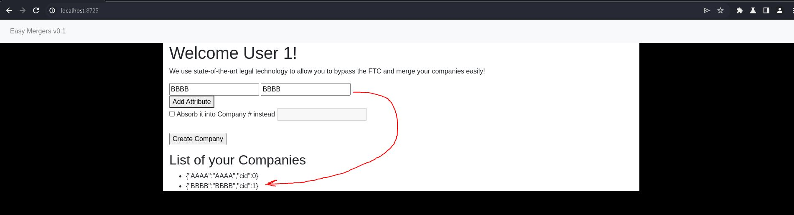
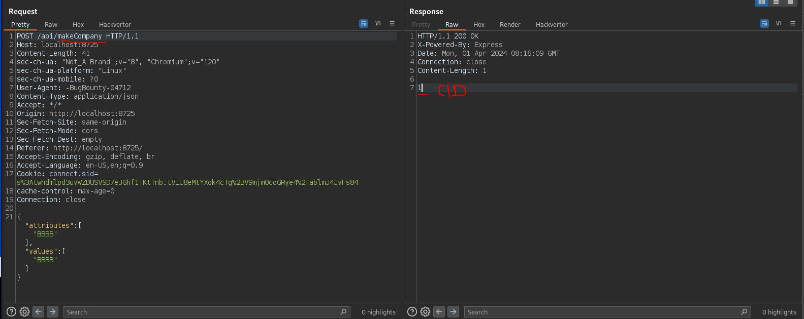
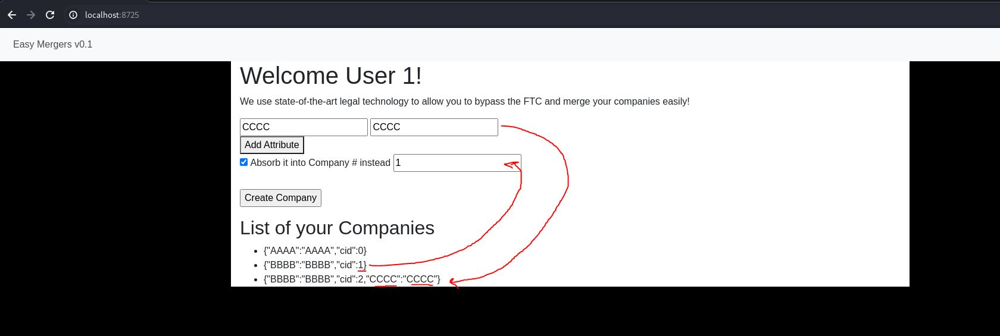
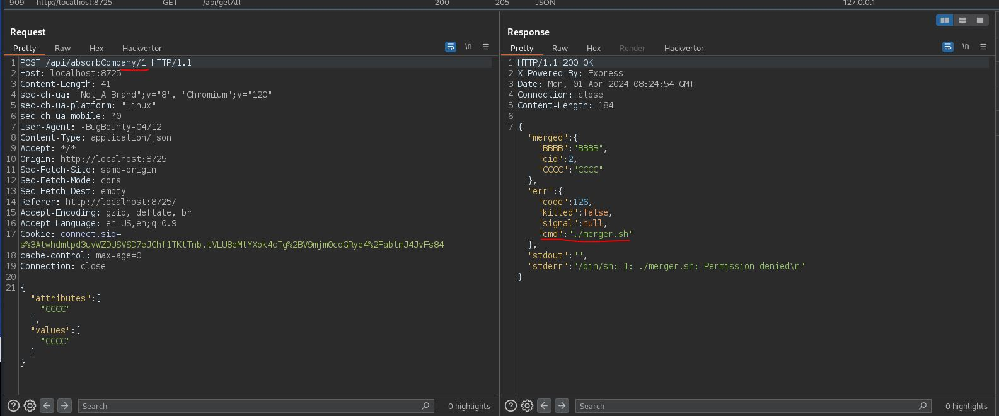
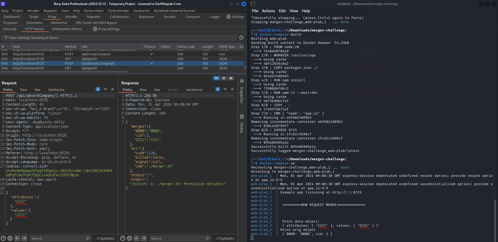
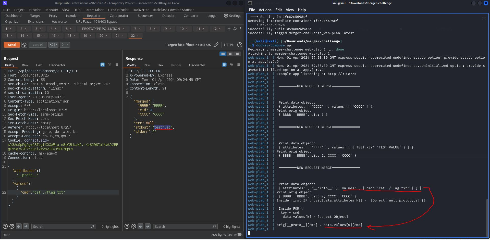
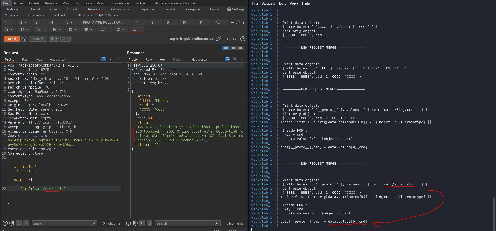

# Easy Mergers v0.1

Challenge category : web\
Description :
```
Tired of getting your corporate mergers blocked by the FTC? Good news! Just give us your corporate information and let our unpaid interns do the work!

By Samintell (@samintell on discord)
```

The challenge is a simple webapp written in nodejs. [SOURCE](./src/) 
At first glance it is immediately clear (also from the title) that the app merges objects (called "companies"), analyzing the source we see that there are 2 endpoints:
```
/api/makeCompany
/api/absorbCompany/:cid
```
Let's try to understand how the app works : when we create a company (without the "absorb" flag) it creates an object with the values and attributes that we gave as input





The snippet of code that manages this endpoint is this:
```javascript
app.post('/api/makeCompany', function (req, res) {
  if (!req.session.init) {
    res.end("invalid session");
    return;
  }
  let data = req.body;
  if (data.attributes === undefined || data.values === undefined ||
    !Array.isArray(data.attributes) || !Array.isArray(data.values)) {
    res.end('attributes and values are incorrectly set');
    return;
  }
  
  let cNum = userCompanies[req.session.uid].length;
  let cObj = new Object();
  for (let j = 0; j < Math.min(data.attributes.length, data.values.length); j++) {
    if (data.attributes[j] != '' && data.attributes[j] != null) {
      cObj[data.attributes[j]] = data.values[j];
    }
    
  }
  cObj.cid = cNum;
  userCompanies[req.session.uid][cNum] = cObj;

  res.end(cNum + "");
})
```

instead when we create a company with the "absorb" flag by inserting the CID of another previously created company, it merges the two companies into a single object




As we notice from the response in Burp there are parameters `cmd` , `stdout`, `stderr` , so let's take a look at the source , in the route `app.post('/api/absorbCompany/:cid', function (req, res)` , we notice that a child process is started `merger.js` : 

```javascript
function isObject(obj) {
    return typeof obj === 'function' || typeof obj === 'object';
}

var secret = {}

const {exec} = require('child_process');

process.on('message', function (m) {
    let data = m.data;
    let orig = m.orig;
    for (let k = 0; k < Math.min(data.attributes.length, data.values.length); k++) {

        if (!(orig[data.attributes[k]] === undefined) && isObject(orig[data.attributes[k]]) && isObject(data.values[k])) {
            for (const key in data.values[k]) {
                orig[data.attributes[k]][key] = data.values[k][key];
            }
        } else if (!(orig[data.attributes[k]] === undefined) && Array.isArray(orig[data.attributes[k]]) && Array.isArray(data.values[k])) {
            orig[data.attributes[k]] = orig[data.attributes[k]].concat(data.values[k]);
        } else {
            orig[data.attributes[k]] = data.values[k];
        }
    }
    cmd = "./merger.sh";

    if (secret.cmd != null) {
        cmd = secret.cmd;
    }

    
    var test = exec(cmd, (err, stdout, stderr) => {
        retObj = {};
        retObj['merged'] = orig;
        retObj['err'] = err;
        retObj['stdout'] = stdout;
        retObj['stderr'] = stderr;
        process.send(retObj);
    });
    console.log(test);
});

```
In this case the goal of the challenge is "edit" (pollute) the `secret.cmd` with a os command like `cat ./flag.txt` , to do this we need to understand first how prototype pollution works ([PortSwigger Docs](https://portswigger.net/web-security/prototype-pollution/server-side) , [Hacktricks Docs](https://book.hacktricks.xyz/pentesting-web/deserialization/nodejs-proto-prototype-pollution))

We added some `console.log()` for debugging purpose , to understand how our input is processed during the execution :

```javascript
function isObject(obj) {
    return typeof obj === 'function' || typeof obj === 'object';
}

var secret = {}

const {exec} = require('child_process');

process.on('message', function (m) {
    console.log("\n\n =========NEW REQUEST MERGE============== \n\n")
    let data = m.data; // data: { attributes: [ '__proto__' ], values: [ [Object] ] }
    let orig = m.orig; // orig: { BBBB: 'BBBB', cid: 1 }
    console.log("\n Print data object: \n",data,"\nPrint orig object\n",orig)
    for (let k = 0; k < Math.min(data.attributes.length, data.values.length); k++) {
        
        if (!(orig[data.attributes[k]] === undefined) && isObject(orig[data.attributes[k]]) && isObject(data.values[k])) {
            console.log("Inside first IF : orig[data.attributes[k]] = ",orig[data.attributes[k]])
            
            for (const key in data.values[k]) {
            
                console.log(`\n Inside FOR :  \n\tkey = ${key} \n\t data.values[k] = ${data.values[k]} `)
            
                orig[data.attributes[k]][key] = data.values[k][key];
                console.log(`\norig[${data.attributes[k]}][${key}] = data.values[${k}][${key}]\n`)
            }
        } else if (!(orig[data.attributes[k]] === undefined) && Array.isArray(orig[data.attributes[k]]) && Array.isArray(data.values[k])) {
            
            orig[data.attributes[k]] = orig[data.attributes[k]].concat(data.values[k]);
        } else {
            
            orig[data.attributes[k]] = data.values[k];
        }
    }
    cmd = "./merger.sh";

    if (secret.cmd != null) {
        cmd = secret.cmd;
    }

    
    var test = exec(cmd, (err, stdout, stderr) => {
        retObj = {};
        retObj['merged'] = orig;
        retObj['err'] = err;
        retObj['stdout'] = stdout;
        retObj['stderr'] = stderr;
        process.send(retObj);
    });
    //console.log(test);
});

```



So if we send a legit HTTP request , we can see some debugging log but the first IF statement is not satisfied because the `isObject()` is false , so we can try to pollute `cmd` property :






You can try in your local machine , just download the [src](./src/) and build with docker-compose 


